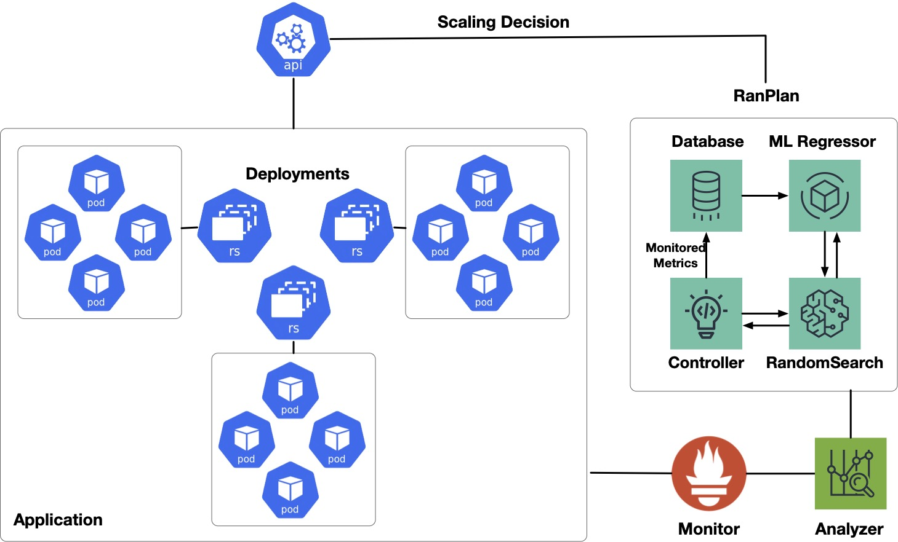

# Meeting SLOs with Efficiency: A Self-Adaptive Auto-Scaling Approach for Cloud-Native Applications

This repository hosts the `Meeting SLOs with Efficiency: A Self-Adaptive Auto-Scaling Approach for Cloud-Native Applications` draft paper. The main focus of the project is the `RanSLOScale` scaling framework designed to dynamically adjust the number of microservice instances in cloud-native applications based on real-time SLO compliance and operational metrics, ensuring both service quality and efficient resource utilization. 

The repository contains the complete `RanSLOScale` codebase, including Offline trainning. It also includes the results of various experiments conducted as part of the project, stored in the `results` directory.


<p align="center">
</p>


## Abstract

Ensuring that cloud-native applications meet Service-Level Objectives while minimizing resource usage is a key challenge in the cloud layer of cloud-based systems. In this paper, we present RanSLOScale, a self-adaptive auto-scaling framework for cloud-native applications orchestrated by Kubernetes. RanSLOScale leverages the MAPE-K loop to continuously monitor both operational metrics and SLO indicators, enabling scaling decisions that adjust the number of microservice instances in real time. The framework addresses both under-provisioning and over-provisioning scenarios, optimizing resource efficiency without compromising service quality. We evaluate RanSLOScale on two representative applications, a cloud-native online shopping system and a chatbot powered by a Large Language Model, demonstrating its effectiveness in maintaining SLO compliance while reducing unnecessary resource consumption.


## Directory Structure

```bash

├── RanSLOScale
│   ├── This is the core directory for RanSLOScale.
├── figs
│   ├── This directory stores images used in the study.
├── results
│   ├── Contains results for research question 1 and 2.
└──


```

## Prerequisites

Before starting, please make sure that the following tools have already been installed:

- Istio 1.23.0
- Prometheus 2.32.1
- Docker 28.0.2
- Kubernetes: 
  - Client Version: v1.30.3
  - Kustomize Version: v5.0.4-0.20230601165947-6ce0bf390ce3
  - Server Version: v1.26.0
- Python 3.12.3


###  Licensing
RanSLOScale is licensed under the GPL license.
